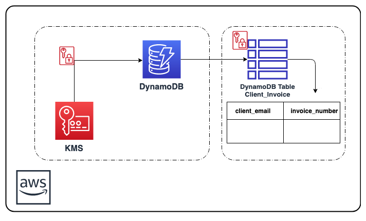

# aws-encrypted-dynamodb-cf-template

## Description:

This <a href="https://aws.amazon.com/cloudformation/" target="_blank">AWS CloudFormation</a> solution creates an AES-256 encrypted <a href="https://aws.amazon.com/dynamodb/" target="_blank"> AWS DynamoDB</a> table. The encryption key is managed via <a href="https://aws.amazon.com/kms" target="_blank"> AWS KMS</a>. Once your data is encrypted, Amazon DynamoDB handles authentication of access and decryption of your data transparently with a minimal impact on performance. You don't need to modify your database client applications to use encryption at rest.

AWS CloudFormation provides a common language for you to describe and provision all the infrastructure resources in your cloud environment.

Amazon DynamoDB is a key-value and document database that delivers single-digit millisecond performance at any scale. It's a fully managed, multiregion, multimaster database with built-in security, backup and restore, and in-memory caching for internet-scale applications. DynamoDB can handle more than 10 trillion requests per day and can support peaks of more than 20 million requests per second.

AWS Key Management Service (KMS) makes it easy for you to create and manage keys and control the use of encryption across a wide range of AWS services and in your applications. AWS KMS is a secure and resilient service that uses FIPS 140-2 validated hardware security modules to protect your keys.

## AWS Resource Costs

As with most AWS services you will incur costs for usage. For this CloudFormation template the resources that incur costs are as follows.

* Pricing:

   * <a href="https://aws.amazon.com/dynamodb/pricing/" target="_blank">DynamoDB pricing</a> resource used in example: *1 Provisioned Write and 1 Provisioned Read Capacity Unit*
   * <a href="https://aws.amazon.com/kms/pricing/" target="_blank">KMS pricing</a> resource used in example: *1 KMS key*

## Prerequisites

* <a href="https://aws.amazon.com" target="_blank"> Amazon Web Services Account</a>
* <a href="https://aws.amazon.com/iam/" target="_blank">IAM</a> user with the following permissions:
   * AWSCloudFormationReadOnlyAccess
   * AmazonDynamoDBFullAccess

## CloudFormation Template

* The CloudFormation Template is available on GitHub:
   * <a href="https://github.com/getcft/aws-encrypted-dynamodb-cf-template" target="_blank">aws-encrypted-dynamodb-cf-template</a>

## Deploy the CloudFormation Template

* AWS Management Console

   * Login to *AWS Management Console*
   * Launch under *CloudFormation* your *encrypted-dynamodb-cf-template.yml* (included in this repo)

* CloudFormation Fields:

   * *Stack name* (Enter a name to associate to your AWS DynamoDB deployment)
   * Continue choosing *Next*
   * Click *Create* (This will take a few minutes for resources to be created)

## Results of the CloudFormation Template

In the *AWS Management Console* you should be able to verify the following have been created.

* Resources Created:
   * 1 KMS AWS owned CMK for encryption
   * 1 example *Client_Invoice* encrypted DynamoDB table, with a primary partition key *client_email* (type string), and a primary sort key *invoice_number* (type string).
